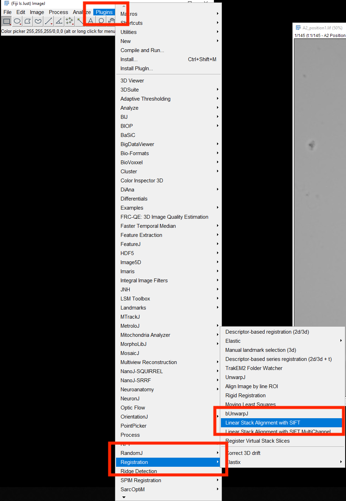
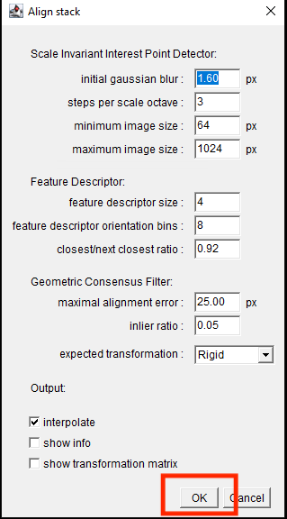

## Overview

This guide describes how to register a brightfield time-lapse image stack
using the **Linear Stack Alignment with SIFT** plugin in Fiji/ImageJ.

Image registration corrects movement or drift between frames so that
stationary structures remain aligned throughout the time series.

## Step 1: Open the Time-Lapse Image

1. Launch **Fiji/ImageJ**.
2. Open the brightfield time-lapse dataset.
3. Confirm that the dataset is displayed as an image stack.

You can verify the number of frames using:

**Image → Properties**

## Step 2: Open the SIFT Registration Tool

From the Fiji menu, select:

**Plugins → Registration → Linear Stack Alignment with SIFT**

{fig-alt="Location of the Linear Stack Alignment with SIFT plugin in Fiji" width=70%}

## Step 3: Configure the SIFT Parameters

The **Align stack** window will appear.

For most datasets, begin with the default parameters.

### Scale Invariant Interest Point Detector

| Parameter | Default |
|---|---:|
| Initial Gaussian blur | 1.60 px |
| Steps per scale octave | 3 |
| Minimum image size | 64 px |
| Maximum image size | 1024 px |

### Feature Descriptor

| Parameter | Default |
|---|---:|
| Feature descriptor size | 4 |
| Feature descriptor orientation bins | 8 |
| Closest/next closest ratio | 0.92 |

### Geometric Consensus Filter

| Parameter | Default |
|---|---:|
| Maximal alignment error | 25.00 px |
| Inlier ratio | 0.05 |
| Expected transformation | Rigid |

For the **Output** settings, keep **Interpolate** selected.

{fig-alt="Default SIFT alignment settings in Fiji" width=55%}

## Step 4: Run the Registration

Click **OK**.

Fiji will analyze consecutive frames, identify corresponding image features,
and calculate the transformations required to align the stack.

Processing time will depend on:

- Image dimensions
- Number of time points
- Number of detectable image features
- Computer performance

## Step 5: Inspect the Registered Stack

After registration is complete:

1. Play through the image stack.
2. Identify a stationary feature in the field of view.
3. Confirm that the feature remains in approximately the same location
   throughout the time series.

The biological structures of interest may still move. The goal is to remove
**whole-field drift**, not biological motion.

## Step 6: Save the Registered Dataset

To preserve the registered result, select:

**File → Save As → Tiff**

Use a filename that distinguishes the registered image from the original.

For example:

```text
Experiment01_Brightfield_Registered.tif